# Laboratorio 03 previo al Proyecto 2

Universidad del Valle de Guatemala
Facultad de Ingeniería, Departamento de Ciencias de la Computación
CC3069 Computación Paralela y Distribuida, Ciclo 2 de 2026

Integrantes: Iris Ayala, Anggie Quezada, Gabriel Bran

---

## 1. Investigación sobre AES

AES (Advanced Encryption Standard) es un algoritmo de cifrado simétrico que fue elegido como estándar por el NIST en el año 2001, y está definido en el documento FIPS-197. Que sea simétrico quiere decir que se usa la misma clave para cifrar y para descifrar, entonces quien manda el mensaje y quien lo recibe tienen que compartir esa clave de antemano. Antes de AES se usaba DES, pero DES tenía una clave muy corta (56 bits) y con el tiempo se volvió fácil de romper por fuerza bruta, por eso se buscó un reemplazo. El algoritmo que ganó el concurso se llamaba Rijndael y fue creado por dos criptógrafos belgas, Joan Daemen y Vincent Rijmen. Hoy AES es probablemente el cifrado más usado del mundo, y muchos procesadores modernos hasta traen instrucciones especiales (AES-NI) para hacerlo más rápido.

### a) Campos de aplicación

Uno de los usos más comunes de AES está en la navegación web. Cada vez que una página usa HTTPS, el navegador y el servidor negocian una conexión TLS y los datos que viajan entre los dos normalmente se cifran con AES (por ejemplo AES-128-GCM o AES-256-GCM). Así, aunque alguien intercepte el tráfico, lo único que ve son bytes sin sentido.

Otro campo es el de las redes inalámbricas. Los protocolos de seguridad WiFi WPA2 y WPA3 usan AES para cifrar lo que se manda por el aire entre el dispositivo y el router. Esto es importante porque en una red inalámbrica cualquiera que esté cerca podría captar las señales.

También se usa mucho en el cifrado de almacenamiento. Herramientas como BitLocker en Windows, FileVault en macOS o LUKS en Linux cifran el disco completo con AES, y los celulares con iOS y Android hacen lo mismo con la información guardada en el teléfono. De esta forma, si alguien roba la computadora o el celular, no puede leer los archivos sin la clave.

Además de esos tres, AES aparece en las VPN (por ejemplo con IPsec u OpenVPN), en aplicaciones de mensajería como WhatsApp y Signal, en gestores de contraseñas, y en los servicios de nube como AWS, Azure o Google Cloud, que cifran con AES los datos que los usuarios guardan en sus servidores.

### b) Cifrado y descifrado con AES-128

AES es un cifrado por bloques, lo que significa que no cifra el texto letra por letra sino en pedazos de tamaño fijo. En AES ese bloque siempre es de 128 bits, o sea 16 bytes. Lo que cambia entre las versiones de AES es el tamaño de la clave, que puede ser de 128, 192 o 256 bits. En AES-128 la clave mide 128 bits (16 bytes) y el algoritmo hace 10 rondas de transformaciones. Las otras versiones hacen más rondas (12 para AES-192 y 14 para AES-256).

Los 16 bytes del bloque se acomodan en una matriz de 4 por 4 que se llama "estado", y todas las transformaciones se aplican sobre ese estado. Si el texto que se quiere cifrar mide más de 16 bytes, se parte en varios bloques, y la forma en que esos bloques se combinan entre sí depende del modo de operación que se use (ECB, CBC, CTR, GCM, entre otros). Si el texto no es múltiplo de 16 se le agrega relleno o padding al final para completar el último bloque.

Antes de empezar a cifrar, AES hace la expansión de clave (key schedule). La clave de 16 bytes no se usa tal cual en todas las rondas, sino que a partir de ella se generan 11 claves de ronda, una para el paso inicial y una para cada una de las 10 rondas. Para generarlas se usan operaciones como rotar bytes (RotWord), pasarlos por la S-Box (SubWord) y hacer XOR con unas constantes de ronda (Rcon). Gracias a esto cada ronda usa una clave distinta, aunque todas salen de la misma clave original.

Las transformaciones principales del algoritmo son cuatro. SubBytes cambia cada byte del estado por otro usando una tabla fija llamada S-Box, y es la parte no lineal del algoritmo, la que hace que la relación entre la entrada y la salida sea difícil de adivinar. ShiftRows rota las filas de la matriz hacia la izquierda, la primera fila no se mueve, la segunda se corre una posición, la tercera dos y la cuarta tres, y eso hace que los bytes de una columna se repartan a otras columnas. MixColumns toma cada columna y la multiplica por una matriz fija usando aritmética en el campo GF(2⁸), de modo que cada byte de salida depende de los cuatro bytes de la columna. Por último, AddRoundKey hace un XOR entre el estado y la clave de esa ronda, y es el único paso donde la clave entra directamente a mezclarse con los datos.

Para cifrar con AES-128 primero se hace un AddRoundKey con la primera clave de ronda (la clave 0). Después vienen las rondas 1 a 9, y en cada una se aplican en orden SubBytes, ShiftRows, MixColumns y AddRoundKey con la clave de esa ronda. La ronda 10 es la última y es un poco diferente, porque solo hace SubBytes, ShiftRows y AddRoundKey, sin MixColumns. Lo que queda al final en el estado es el bloque cifrado de 16 bytes.

Para descifrar se hace el proceso al revés usando las versiones inversas de cada transformación (InvSubBytes, InvShiftRows e InvMixColumns; AddRoundKey es su propio inverso porque hacer XOR dos veces con lo mismo regresa al valor original). Las claves de ronda también se usan en orden inverso. Se empieza con AddRoundKey usando la clave 10, luego para las rondas 9 a 1 se aplican InvShiftRows, InvSubBytes, AddRoundKey con la clave de esa ronda e InvMixColumns, y en la ronda final se hacen InvShiftRows, InvSubBytes y AddRoundKey con la clave 0. Con eso se recupera el texto original. Por eso es tan importante que las dos partes tengan la misma clave, ya que sin ella no se pueden generar las claves de ronda correctas y no hay forma de deshacer los pasos.

### c) Diagrama de flujo

En el diagrama se ve que la clave original pasa primero por la expansión de clave, y de ahí salen las 11 claves de ronda (k0 a k10). En el cifrado se usan de la k0 a la k10, y en el descifrado se usan en el orden contrario, de la k10 a la k0. La clave participa en cada paso de AddRoundKey de los dos procesos.

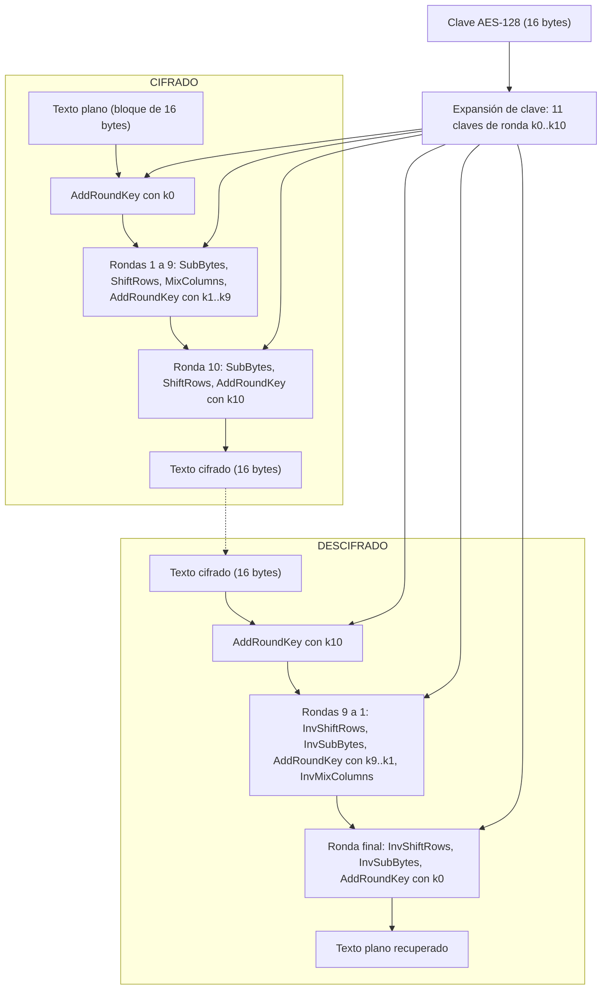

---

## 2. Análisis del programa secuencial

El programa `busqueda_clave_aes_secuencial.c` hace una búsqueda por fuerza bruta: primero cifra el mensaje `"Puedes lograrlo!"` con una clave secreta (12345) y después prueba todas las claves candidatas desde 0 hasta 2²⁰ − 1, descifrando el texto cifrado con cada una y comparando el resultado con el mensaje original. Cuando encuentra una que coincide, se detiene e imprime la clave, el mensaje y el tiempo.

### ¿Usa correctamente AES-128?

A nivel de la librería sí lo usa bien. Si lo comparamos con lo investigado en la sección 1:

| Aspecto | Lo investigado | Lo que hace el programa | ¿Correcto? |
|---|---|---|---|
| Tamaño de la clave | 128 bits (16 bytes) | `unsigned char key[16]` y `EVP_aes_128_ecb()` | Sí |
| Tamaño del bloque | 128 bits (16 bytes) | `MESSAGE_LEN = 16` y un `_Static_assert` que obliga a que el mensaje mida 16 bytes | Sí |
| Cifrado y descifrado | misma clave, el descifrado es la operación inversa | la misma función `crypt_block` con `encrypt = 1` para cifrar y `encrypt = 0` para descifrar, usando la misma clave | Sí |
| Relleno (padding) | necesario si el texto no es múltiplo de 16 | `EVP_CIPHER_CTX_set_padding(ctx, 0)`, válido porque el mensaje mide exactamente un bloque | Sí, pero solo para este mensaje |
| Rondas y transformaciones | 10 rondas, SubBytes, ShiftRows, MixColumns, AddRoundKey | las hace OpenSSL internamente a través de la interfaz EVP | Sí |

O sea, el algoritmo AES-128 que se ejecuta es el real (el de OpenSSL), el tamaño de clave y de bloque son correctos y el descifrado es el inverso del cifrado. Lo que no es correcto es la forma en que se usa: la clave no tiene 128 bits de aleatoriedad, el modo ECB no es seguro y el programa solo funciona con mensajes de exactamente 16 bytes. Esos problemas se explican en la sección 3.

### Compilación y ejecución

En Linux (Ubuntu/WSL):

```bash
sudo apt update
sudo apt install libssl-dev
gcc -std=c11 -O2 -Wall -Wextra busqueda_clave_aes_secuencial.c -o busqueda_clave_aes_secuencial -lcrypto
./busqueda_clave_aes_secuencial
```

En macOS no existe `apt`, así que OpenSSL se instala con Homebrew (`brew install openssl@3`) y hay que indicarle a `gcc` dónde están sus encabezados y la librería:

```bash
gcc -std=c11 -O2 -Wall -Wextra -I/opt/homebrew/opt/openssl@3/include busqueda_clave_aes_secuencial.c \
    -o busqueda_clave_aes_secuencial -L/opt/homebrew/opt/openssl@3/lib -lcrypto
./busqueda_clave_aes_secuencial
```

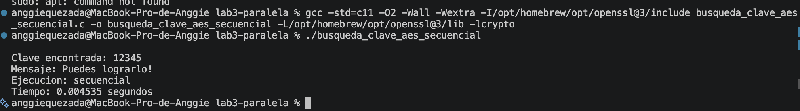
*Captura 2.1: compilación y ejecución del programa secuencial original en macOS.*

El programa compila sin advertencias, incluso con `-Wall -Wextra`. Para el inciso e), el tiempo se mide con `clock_gettime(CLOCK_MONOTONIC)`, un reloj que no se ve afectado si cambia la hora del sistema. La medición empieza después de cifrar el mensaje, así que solo cuenta el tiempo de la búsqueda, y se imprime en pantalla al final. El tiempo es muy pequeño (unos 4.5 milisegundos) porque la clave secreta es 12345 y el programa se detiene en cuanto la encuentra, de modo que solo prueba 12 346 de las 1 048 576 candidatas. Con un tiempo tan corto no se puede medir bien el Speedup, y por eso en la versión corregida la clave por defecto está cerca del final del rango.

---

## 3. Errores conceptuales y limitaciones

### a) Análisis

**Construcción de la clave.** La función `make_key` llena los 16 bytes de la clave con ceros y solo copia el número candidato en los últimos 8 bytes. Por ejemplo, la clave 12345 queda como `00000000000000000000000000003039`. Aunque la clave mide 128 bits, en la práctica solo varían 64 bits y, como la búsqueda llega hasta 2²⁰, el secreto real tiene apenas 20 bits. Una clave AES de verdad tiene que ser aleatoria en sus 128 bits (generada con algo como `RAND_bytes`) o derivarse de una contraseña con un KDF como PBKDF2 o Argon2. Con esta construcción, cualquiera que sepa cómo se arma la clave sabe que basta con probar números pequeños.

**El modo ECB.** ECB cifra cada bloque por separado y no usa IV (vector de inicialización). Eso hace que dos bloques iguales de texto plano siempre den el mismo bloque cifrado, así que el texto cifrado deja ver los patrones del original (el ejemplo clásico es la imagen del pingüino cifrada con ECB, donde todavía se ve la figura). Además, cifrar dos veces el mismo mensaje con la misma clave da exactamente el mismo resultado, y un atacante puede saber si se repitió un mensaje. Como aquí hay un solo bloque los patrones no se notan, pero ECB no debería usarse para datos reales. ECB tampoco autentica: si alguien modifica el texto cifrado, el programa no se entera.

**El uso del texto original para verificar las candidatas.** Para decidir si una clave es correcta, el programa compara el texto descifrado con `message`, es decir, con el mensaje original completo. En un ataque real eso no tiene sentido: si el atacante ya tuviera el mensaje, no necesitaría descifrarlo. En la práctica solo se conoce una parte (la cabecera de un archivo, un prefijo fijo de un protocolo, un formato esperado) o se usa un MAC o checksum para confirmar la clave. Aquí la comparación funciona como un "oráculo" que solo existe en el laboratorio. También hace que el programa dependa de un mensaje de exactamente 16 bytes.

**El espacio completo de AES-128 contra el rango explorado.** AES-128 tiene 2¹²⁸ ≈ 3.4 × 10³⁸ claves posibles, y el programa solo explora 2²⁰ = 1 048 576, es decir, 2⁻¹⁰⁸ del espacio total (alrededor de 3 × 10⁻³¹ %). La búsqueda termina en milisegundos solo porque la clave secreta está dentro de ese rango tan pequeño. Para tener una idea: a unos 10⁷ claves por segundo, que es más o menos lo que alcanza esta implementación en una laptop, recorrer las 2¹²⁸ claves tomaría del orden de 10²⁴ años. Aunque se paralelice con miles de procesos, la fuerza bruta contra AES-128 con una clave bien generada no es viable. El programa demuestra la técnica, pero no demuestra que AES se pueda romper.

**Otras limitaciones.**
- `TOTAL_KEYS`, `SECRET_KEY` y el mensaje están fijos en el código, así que para probar otro caso hay que recompilar.
- En cada candidata se llama a `EVP_CipherInit_ex` con el algoritmo completo y se vuelve a configurar el relleno, aunque eso nunca cambia; ese trabajo se repite más de un millón de veces.
- Solo se imprime el número de la clave y no los 16 bytes reales.
- El encabezado del archivo dice CC3169 en lugar de CC3069.

### b) Mejoras propuestas e implementadas

Las mejoras están en un archivo aparte, `busqueda_clave_aes_secuencial_mejorado.c`, para conservar el original del ejercicio 2 y poder comparar ambos. Esta versión corregida es la base de la versión paralela del ejercicio 4.

| # | Mejora | Tipo | Justificación | Propuesta por |
|---|---|---|---|---|
| M1 | Usar **AES-128-CBC con IV aleatorio** (`RAND_bytes`) en lugar de ECB | Seguridad | En CBC cada bloque se combina con el bloque cifrado anterior, y el primero con el IV. Con un IV aleatorio el mismo mensaje cifrado dos veces da resultados distintos y ya no se filtran patrones. El IV no es secreto; viaja junto con el texto cifrado. | ____________ |
| M2 | Recibir el **rango (`bits`), la clave secreta y el mensaje por línea de comandos**, con validación de los argumentos (`strtoull` con control de errores, `bits` entre 1 y 40, mensaje de 1 a 1024 bytes). Se aceptan mensajes de **cualquier largo** usando el relleno PKCS#7. | Flexibilidad | Permite cambiar el tamaño del problema y probar distintos casos sin recompilar, incluido el caso en que la clave no está en el rango. Además, el programa deja de estar limitado a mensajes de exactamente 16 bytes. | ____________ |
| M3 | Configurar el **contexto EVP una sola vez** (algoritmo y relleno) y en cada candidata cargar solo la clave con `EVP_CipherInit_ex(ctx, NULL, NULL, key, iv, -1)` | Rendimiento | Evita repetir más de un millón de veces la selección del algoritmo y la configuración del relleno, que nunca cambian. | ____________ |
| M4 | **Verificar con un fragmento conocido**: la búsqueda descifra y compara solo el primer bloque (16 bytes), y el mensaje completo se descifra una sola vez, con la clave encontrada | Rendimiento / realismo | Imita un ataque de texto conocido, donde el atacante solo conoce una parte (por ejemplo una cabecera). Además, cada candidata cuesta lo mismo aunque el mensaje sea largo, porque siempre se descifra un único bloque. La probabilidad de que una clave incorrecta coincida en los 16 bytes es de aproximadamente 2⁻¹²⁸. | ____________ |
| M5 | **Reporte más completo**: la clave en hexadecimal (16 bytes), el IV, las candidatas probadas, la velocidad en claves/s, la fracción del espacio de AES-128 explorada y si el mensaje recuperado coincide con el original | Claridad | Hace visible la limitación del rango (2²⁰ de 2¹²⁸) y da datos útiles para comparar la versión secuencial con la paralela. | ____________ |

Además, la clave secreta por defecto pasó de 12345 a 1 000 000. Así la búsqueda recorre casi todo el rango (1 000 001 de 1 048 576 candidatas) y dura lo suficiente para medir el Speedup en el ejercicio 4.

La construcción de la clave (`ceros || contador`) **se dejó igual a propósito**, porque el ejercicio necesita un espacio de claves que se pueda enumerar. En un sistema real la clave saldría de `RAND_bytes` o de un KDF, y convendría usar un modo autenticado como AES-GCM, que además de cifrar detecta si el mensaje fue modificado.

### Compilación y ejecución del programa corregido

```bash
gcc -std=c11 -O2 -Wall -Wextra busqueda_clave_aes_secuencial_mejorado.c -o busqueda_clave_aes_secuencial_mejorado -lcrypto

./busqueda_clave_aes_secuencial_mejorado   # valores por defecto: bits=20, secreta=1000000
./busqueda_clave_aes_secuencial_mejorado 16 777 "Hola"         # mensaje corto (menos de un bloque)
./busqueda_clave_aes_secuencial_mejorado 18 200000 "Estoques de AES-128 en CBC."   # mensaje de varios bloques
./busqueda_clave_aes_secuencial_mejorado 12 5000               # clave fuera del rango: se agota sin encontrarla
```

(En macOS se agregan las mismas opciones `-I` y `-L` de Homebrew que en la sección 2.)

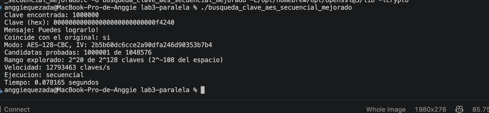
*Captura 3.1: programa corregido con los valores por defecto (bits=20, secreta=1000000). Prueba 1 000 001 candidatas y recupera el mensaje original.*

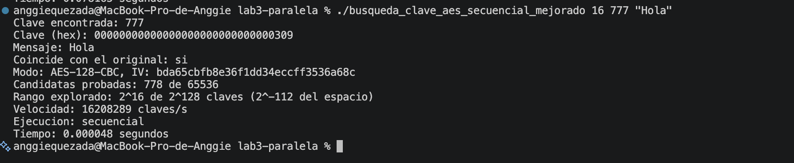
*Captura 3.2: mensaje corto de menos de un bloque ("Hola", bits=16, clave 777). El relleno PKCS#7 completa el bloque y el mensaje se recupera sin problema.*

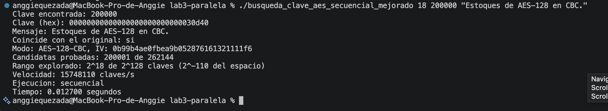
*Captura 3.3: mensaje de 27 bytes, que ocupa dos bloques de AES (bits=18, clave 200000). La búsqueda solo compara el primer bloque y después se descifra el mensaje completo.*

El caso de la clave fuera del rango (`12 5000`) se muestra junto con la versión paralela en la captura 4.5. El IV cambia en cada ejecución porque es aleatorio, y el tiempo depende de la máquina.

---

## 4. Versión paralela con Open MPI

### a) Diseño de la versión paralela

La versión paralela está en `busqueda_clave_aes_mpi.c` y parte directamente del programa corregido (`busqueda_clave_aes_secuencial_mejorado.c`). Conserva todas sus mejoras: AES-128-CBC con IV aleatorio, los mismos argumentos (`bits`, `secreta`, `mensaje`), el contexto EVP configurado una sola vez, la verificación con el primer bloque y el mismo reporte. Lo único que cambia es cómo se reparte la búsqueda y cómo se mide el tiempo.

**Preparación.** Solo el proceso 0 genera el IV y cifra el mensaje con la clave secreta. Después manda a todos los procesos el IV, el largo del texto cifrado y el texto cifrado con `MPI_Bcast`. Así los demás procesos nunca conocen la clave secreta, igual que en un ataque real, y todos buscan sobre el mismo texto cifrado.

**Distribución sin omitir ni repetir candidatas.** Se usa una distribución cíclica: el proceso `r` de `n` prueba las candidatas `r, r + n, r + 2n, ...`. Cada número `k` del rango `0 .. 2^bits − 1` le toca a un único proceso (al de rango `k mod n`), entonces ninguna candidata se omite y ninguna se prueba dos veces. Se eligió cíclica y no por bloques porque con bloques el proceso al que le toca la clave podría ser el último, y los demás terminarían su parte sin encontrar nada; con la distribución cíclica todos avanzan juntos por el rango y la clave se encuentra en la iteración `k / n`, sin importar dónde esté.

**Coordinación de la finalización.** Cada 4096 iteraciones todos los procesos hacen un `MPI_Allreduce` con `MPI_MIN` de su hallazgo local (que vale `UINT64_MAX` si todavía no encontraron nada). Si el resultado es distinto de `UINT64_MAX`, alguien encontró la clave y todos salen del ciclo al mismo tiempo. Si nadie la encuentra, todos hacen el mismo número de iteraciones, `ceil(2^bits / n)`, así que terminan juntos al agotar el rango. Al final hay un último `MPI_Allreduce` para cubrir el caso en que el rango termina entre dos chequeos. El chequeo no se hace en cada iteración porque comunicarse un millón de veces costaría más que la propia búsqueda; con 4096 iteraciones el costo de comunicación es pequeño y, en el peor caso, los procesos prueban unas pocas miles de candidatas de más después de encontrar la clave (por eso "Candidatas probadas" sale un poco mayor que en la versión secuencial). Usar `MPI_MIN` asegura que se reporte la menor clave que coincide, que es la misma que encuentra la versión secuencial.

**Medición del tiempo.** Antes de empezar se hace un `MPI_Barrier` para que todos arranquen juntos, y el tiempo se toma con `MPI_Wtime()`. Igual que en la versión secuencial, solo se mide la búsqueda. Como cada proceso mide su propio tiempo, se reporta el máximo con `MPI_Reduce(MPI_MAX)`, porque la ejecución no termina hasta que termina el proceso más lento. El total de candidatas probadas se suma con `MPI_Reduce(MPI_SUM)`.

### Compilación y ejecución

```bash
sudo apt install openmpi-bin libopenmpi-dev
mpicc -std=c11 -O2 -Wall -Wextra busqueda_clave_aes_mpi.c -o busqueda_clave_aes_mpi -lcrypto

mpirun -np 4 ./busqueda_clave_aes_mpi                     # valores por defecto: bits=20, secreta=1000000
mpirun -np 3 ./busqueda_clave_aes_mpi 16 777 "Hola"
mpirun -np 4 ./busqueda_clave_aes_mpi 18 200000 "Este mensaje tiene varios bloques de AES-128 en CBC."
mpirun -np 3 ./busqueda_clave_aes_mpi 12 5000             # clave fuera del rango: se agota sin encontrarla
```

Ejemplo de salida con 4 procesos y los valores por defecto:

```
Clave encontrada: 1000000
Clave (hex): 000000000000000000000000000f4240
Mensaje: Puedes lograrlo!
Coincide con el original: si
Modo: AES-128-CBC, IV: 57126c5f63536459baba91c214d61ed4
Candidatas probadas: 1011857 de 1048576
Rango explorado: 2^20 de 2^128 claves (2^-108 del espacio)
Velocidad: 20701317 claves/s
Ejecucion: MPI con 4 procesos (distribucion ciclica)
Tiempo: 0.048879 segundos
```

**Verificación.** Se corrieron los mismos cuatro casos de la sección 3 con la versión secuencial y con la paralela (con 1, 2, 3 y 4 procesos). En todos los casos las dos versiones encontraron la misma clave (1 000 000, 777 y 200 000) y el mismo mensaje, con "Coincide con el original: si", y en el caso de la clave fuera del rango las dos recorrieron las 4096 candidatas y reportaron que no la encontraron. El IV cambia entre ejecuciones porque es aleatorio, pero eso no afecta la clave encontrada.

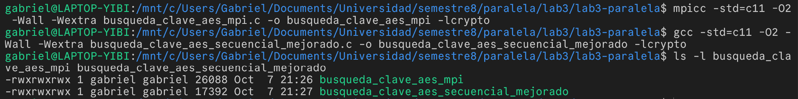
*Captura 4.1: compilación de la versión MPI y de la versión secuencial corregida, sin advertencias con `-Wall -Wextra`.*

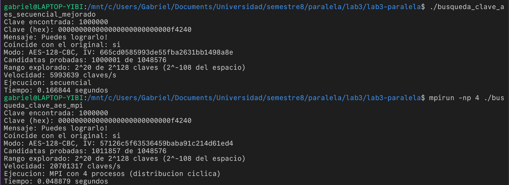
*Captura 4.2: valores por defecto (bits=20, secreta=1000000), versión secuencial y MPI con 4 procesos.*

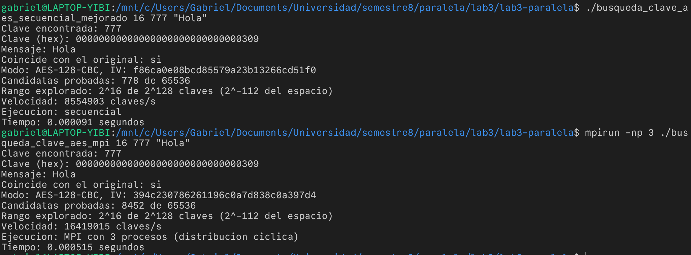
*Captura 4.3: mensaje corto ("Hola", clave 777), versión secuencial y MPI con 3 procesos.*

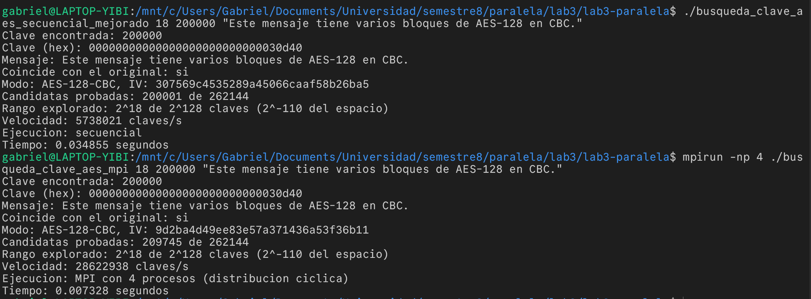
*Captura 4.4: mensaje de varios bloques (clave 200000), versión secuencial y MPI con 4 procesos.*

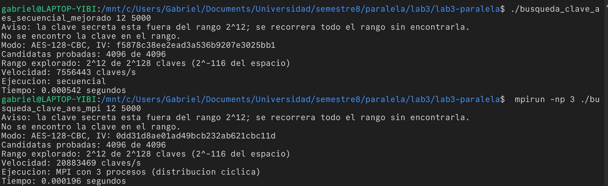
*Captura 4.5: clave fuera del rango (bits=12, secreta=5000), versión secuencial y MPI con 3 procesos.*

### b) Tiempos y Speedup

Con los valores por defecto (2²⁰ candidatas) la búsqueda dura apenas unos 0.05 a 0.1 segundos, y a esa escala el tiempo de arranque y de comunicación pesa demasiado y las mediciones varían mucho entre una corrida y otra. Por eso para medir el Speedup se usó un problema más grande, 2²⁴ candidatas con la clave secreta en 16 000 000 (cerca del final del rango), que en secuencial tarda un poco más de 2 segundos:

```bash
./busqueda_clave_aes_secuencial_mejorado 24 16000000
mpirun -np 2 ./busqueda_clave_aes_mpi 24 16000000
mpirun -np 3 ./busqueda_clave_aes_mpi 24 16000000
mpirun -np 4 ./busqueda_clave_aes_mpi 24 16000000
```

El Speedup se calcula como `S(n) = T_secuencial / T_paralelo(n)`.

| Cantidad de procesos (n) | Tiempo (s) | Speedup calculado |
|---|---|---|
| 1 (secuencial) | 2.409 | 1.00 |
| 2 | 0.924 | 2.61 |
| 3 | 0.690 | 3.49 |
| 4 | 0.397 | 6.06 |

*Mediciones en WSL2 (Ubuntu) con 16 hilos lógicos (captura 4.6). En pruebas previas en la misma máquina, la versión MPI con 1 proceso tardó casi lo mismo que la secuencial, lo que muestra que el costo de MPI es pequeño.*

El Speedup crece con la cantidad de procesos, como se esperaba, porque la búsqueda es un problema "vergonzosamente paralelo": cada candidata se prueba de forma independiente y la única comunicación es el `MPI_Allreduce` cada 4096 iteraciones. Los valores salen incluso por encima del ideal (`S(n) = n`). Esto no significa que el programa haga menos trabajo, ya que el total de candidatas probadas es prácticamente el mismo; lo más probable es que se deba al hardware: en un procesador con núcleos de distinto tipo (de rendimiento y de eficiencia) y con frecuencia variable (turbo), el sistema operativo puede ubicar al proceso secuencial en un núcleo más lento o bajarle la frecuencia, mientras que con varios procesos alguno cae en los núcleos más rápidos. También influye que WSL2 corre dentro de una máquina virtual. Por eso los números exactos cambian según la máquina, pero la tendencia es clara: repartir la búsqueda entre procesos reduce el tiempo casi en proporción al número de procesos.

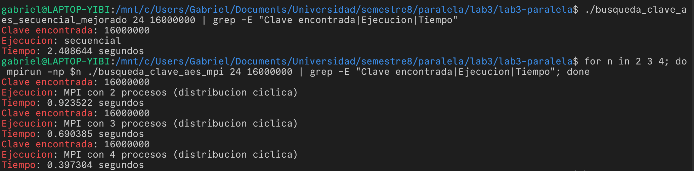
*Captura 4.6: ejecución secuencial y con 2, 3 y 4 procesos usando `24 16000000`.*

---

## Referencias

National Institute of Standards and Technology (2001, actualizado 2023). _FIPS 197: Advanced Encryption Standard (AES)_. https://doi.org/10.6028/NIST.FIPS.197-upd1

Daemen, J. y Rijmen, V. (2002). _The Design of Rijndael: AES – The Advanced Encryption Standard_. Springer.
