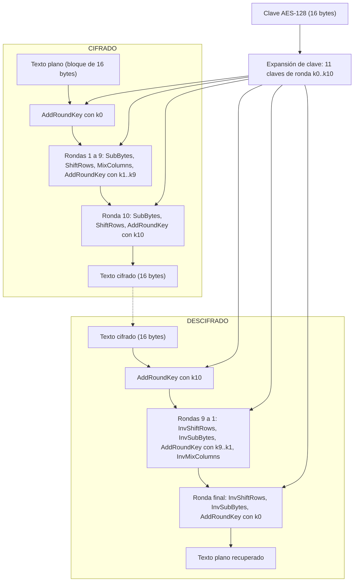

# Laboratorio 03 previo al Proyecto 2

Universidad del Valle de Guatemala
Facultad de Ingeniería, Departamento de Ciencias de la Computación
CC3069 Computación Paralela y Distribuida, Ciclo 2 de 2026

Integrantes: Iris Ayala, Anggie Quezada, Gabriel Bran

---

## 1. Investigación sobre AES

AES (Advanced Encryption Standard) es un algoritmo de cifrado simétrico que fue elegido como estándar por el NIST en el año 2001, y está definido en el documento FIPS-197. Que sea simétrico quiere decir que se usa la misma clave para cifrar y para descifrar, entonces quien manda el mensaje y quien lo recibe tienen que compartir esa clave de antemano. Antes de AES se usaba DES, pero DES tenía una clave muy corta (56 bits) y con el tiempo se volvió fácil de romper por fuerza bruta, por eso se buscó un reemplazo. El algoritmo que ganó el concurso se llamaba Rijndael y fue creado por dos criptógrafos belgas, Joan Daemen y Vincent Rijmen. Hoy AES es probablemente el cifrado más usado del mundo, y muchos procesadores modernos hasta traen instrucciones especiales (AES-NI) para hacerlo más rápido.

### a) Campos de aplicación

Uno de los usos más comunes de AES está en la navegación web. Cada vez que una página usa HTTPS, el navegador y el servidor negocian una conexión TLS y los datos que viajan entre los dos normalmente se cifran con AES (por ejemplo AES-128-GCM o AES-256-GCM). Así, aunque alguien intercepte el tráfico, lo único que ve son bytes sin sentido.

Otro campo es el de las redes inalámbricas. Los protocolos de seguridad WiFi WPA2 y WPA3 usan AES para cifrar lo que se manda por el aire entre el dispositivo y el router. Esto es importante porque en una red inalámbrica cualquiera que esté cerca podría captar las señales.

También se usa mucho en el cifrado de almacenamiento. Herramientas como BitLocker en Windows, FileVault en macOS o LUKS en Linux cifran el disco completo con AES, y los celulares con iOS y Android hacen lo mismo con la información guardada en el teléfono. De esta forma, si alguien roba la computadora o el celular, no puede leer los archivos sin la clave.

Además de esos tres, AES aparece en las VPN (por ejemplo con IPsec u OpenVPN), en aplicaciones de mensajería como WhatsApp y Signal, en gestores de contraseñas, y en los servicios de nube como AWS, Azure o Google Cloud, que cifran con AES los datos que los usuarios guardan en sus servidores.

### b) Cifrado y descifrado con AES-128

AES es un cifrado por bloques, lo que significa que no cifra el texto letra por letra sino en pedazos de tamaño fijo. En AES ese bloque siempre es de 128 bits, o sea 16 bytes. Lo que cambia entre las versiones de AES es el tamaño de la clave, que puede ser de 128, 192 o 256 bits. En AES-128 la clave mide 128 bits (16 bytes) y el algoritmo hace 10 rondas de transformaciones. Las otras versiones hacen más rondas (12 para AES-192 y 14 para AES-256).

Los 16 bytes del bloque se acomodan en una matriz de 4 por 4 que se llama "estado", y todas las transformaciones se aplican sobre ese estado. Si el texto que se quiere cifrar mide más de 16 bytes, se parte en varios bloques, y la forma en que esos bloques se combinan entre sí depende del modo de operación que se use (ECB, CBC, CTR, GCM, entre otros). Si el texto no es múltiplo de 16 se le agrega relleno o padding al final para completar el último bloque.

Antes de empezar a cifrar, AES hace la expansión de clave (key schedule). La clave de 16 bytes no se usa tal cual en todas las rondas, sino que a partir de ella se generan 11 claves de ronda, una para el paso inicial y una para cada una de las 10 rondas. Para generarlas se usan operaciones como rotar bytes (RotWord), pasarlos por la S-Box (SubWord) y hacer XOR con unas constantes de ronda (Rcon). Gracias a esto cada ronda usa una clave distinta, aunque todas salen de la misma clave original.

Las transformaciones principales del algoritmo son cuatro. SubBytes cambia cada byte del estado por otro usando una tabla fija llamada S-Box, y es la parte no lineal del algoritmo, la que hace que la relación entre la entrada y la salida sea difícil de adivinar. ShiftRows rota las filas de la matriz hacia la izquierda, la primera fila no se mueve, la segunda se corre una posición, la tercera dos y la cuarta tres, y eso hace que los bytes de una columna se repartan a otras columnas. MixColumns toma cada columna y la multiplica por una matriz fija usando aritmética en el campo GF(2⁸), de modo que cada byte de salida depende de los cuatro bytes de la columna. Por último, AddRoundKey hace un XOR entre el estado y la clave de esa ronda, y es el único paso donde la clave entra directamente a mezclarse con los datos.

Para cifrar con AES-128 primero se hace un AddRoundKey con la primera clave de ronda (la clave 0). Después vienen las rondas 1 a 9, y en cada una se aplican en orden SubBytes, ShiftRows, MixColumns y AddRoundKey con la clave de esa ronda. La ronda 10 es la última y es un poco diferente, porque solo hace SubBytes, ShiftRows y AddRoundKey, sin MixColumns. Lo que queda al final en el estado es el bloque cifrado de 16 bytes.

Para descifrar se hace el proceso al revés usando las versiones inversas de cada transformación (InvSubBytes, InvShiftRows e InvMixColumns; AddRoundKey es su propio inverso porque hacer XOR dos veces con lo mismo regresa al valor original). Las claves de ronda también se usan en orden inverso. Se empieza con AddRoundKey usando la clave 10, luego para las rondas 9 a 1 se aplican InvShiftRows, InvSubBytes, AddRoundKey con la clave de esa ronda e InvMixColumns, y en la ronda final se hacen InvShiftRows, InvSubBytes y AddRoundKey con la clave 0. Con eso se recupera el texto original. Por eso es tan importante que las dos partes tengan la misma clave, ya que sin ella no se pueden generar las claves de ronda correctas y no hay forma de deshacer los pasos.

### c) Diagrama de flujo

En el diagrama se ve que la clave original pasa primero por la expansión de clave, y de ahí salen las 11 claves de ronda (k0 a k10). En el cifrado se usan de la k0 a la k10, y en el descifrado se usan en el orden contrario, de la k10 a la k0. La clave participa en cada paso de AddRoundKey de los dos procesos.

---

## Referencias

National Institute of Standards and Technology (2001, actualizado 2023). _FIPS 197: Advanced Encryption Standard (AES)_. https://doi.org/10.6028/NIST.FIPS.197-upd1

Daemen, J. y Rijmen, V. (2002). _The Design of Rijndael: AES – The Advanced Encryption Standard_. Springer.
